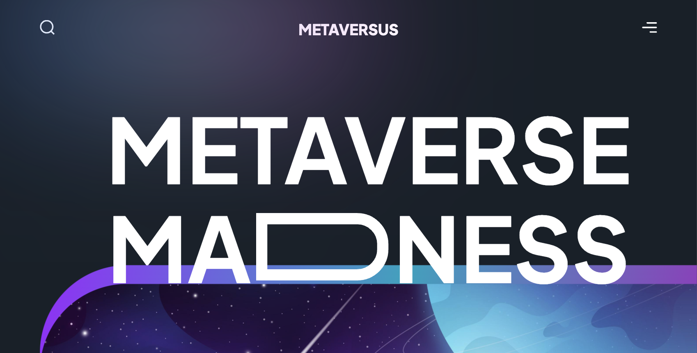

<h1 align='center'>Web 3.0 | Metaversus</h1>

<svg width="40" height="40" fill="#0055ff" role="img" viewBox="0 0 24 24" xmlns="http://www.w3.org/2000/svg"><path d="M4 0h16v8h-8zM4 8h8l8 8H4zM4 16h8v8z"/></svg>

## О проекте:

Проект представляет собой полностью адаптированный современный сайт Web 3.0. Верстка по макету [Figma](https://www.figma.com/file/EyzNoOFak1Nb1bBx9ZKI7E/Modern-UI%2FUX-Framer-Motion?type=design&node-id=1-4&t=8xY6sa1TEi9RjC5r-0)
### Основной инструмент и фреймворк: [Next.js](https://nextjs.org/)
Благодаря использованию Next.js в проект заложена возможность быстрого масштабирования. Мы можем создавать сложные архитектуры, процесс разработки более интуитивный и простой. Так же сайт будет более дружественным для SEO.

### CSS-Фреймворк: [TailwindCSS](https://tailwindcss.com/)
Tailwind интуитивно понятен и существенно ускоряет разработку.
### Motion-фреймворк: [Framer Motion](https://www.framer.com/motion/)
Качественная и плавная анимация делает сайт интересной и дружелюбной к пользователю, который наверняка захочет полностью изучить сайт. Для различных секций и компонентов используются разные анимации. Все анимации приложения собраны для удобства в отдельной папке.
___

## Идея: 

Идея проекта заключалась в том, чтобы создать готовый шаблон современного сайта, который может быть привлекателен разным компаниям, а так же пользователям которые будут его посещать. Используя готовые переиспользуемые компоненты сайт легко наполнить своей или любой другой полезной информацией.
___

## Цель:

Целью работы над проектом было закрепление и расширение навыков работы с Tailwind и Framer Motion. Практика качественной адаптивной верстки по сложному макету, использование градиентных фонов.

**Deploy by Vercel** |
[Посмотреть сайт](https://metaversus-green-seven.vercel.app/)

